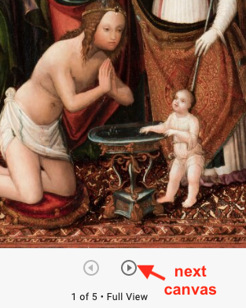
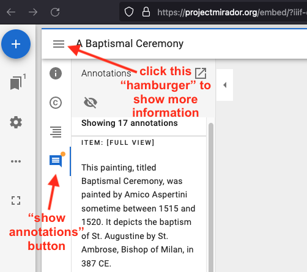
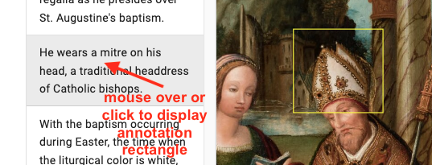
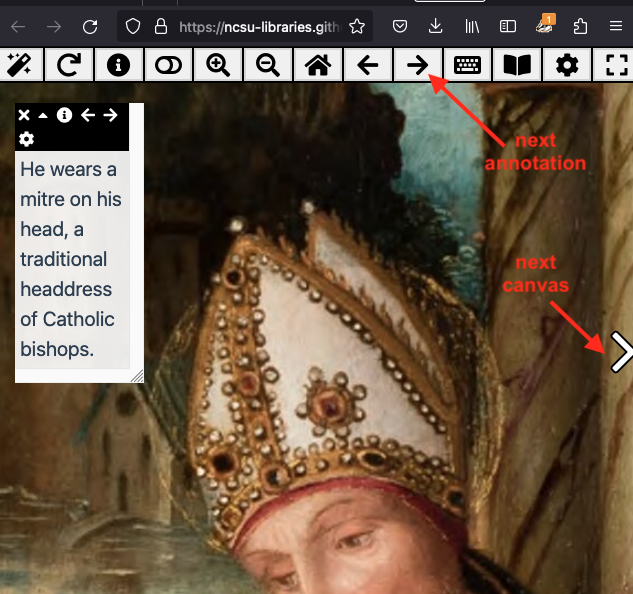

# The project

Displaying rich information about artwork images using the International Image Interoperability Framework (IIIF)

# Description

The [International Image Interoperability Framework](https://iiif.io/) (IIIF) is a cutting-edge technology that provides a mechanism for displaying visual works using a web viewer allowing users to page through and zoom in on related artwork images. In this project, fellows will select a set of artwork images from the [Vanderbilt Art Gallery](https://www.library.vanderbilt.edu/gallery/) image collection, carry out research on the works, and create a IIIF manifest to display the works in a meaningful way. In the process, they will learn more about the IIIF technology as well as having in-depth experience with part of the Gallery collection. The results will be incorporated into the Gallery’s website redesign, allowing fellows’ research to be shared with a broad audience. 

# Fellows

Mara Yella - Chemistry; Classical and Mediterranean Studies - Class of 2023

Faeid Hassan - Architecture and Art; Business - Class of 2025

Haelee Kim - Law, History, and Society; French - Class of 2025

Daniela Cumming - Economics; Business; History of Art - Class of 2025

# Mentors

[Steve Baskauf](https://baskauf.github.io/) - Data Science and Data Curation Specialist - Digital Scholarship and Communications

Mary Anne Caton - Senior Associate Curator of Campus and Community Engagement - Fine Arts Gallery

Rachelle Wilson - Registrar - Fine Arts Gallery

Carla Beals - Library Brand and Graphic Design Manager - Assessment, Communication, and Engagement

# The technology

The centerpiece of IIIF technology is a *manifest*. A manifest contains structured data that describe how images should be displayed on one or more *canvases*. The manifest also contains metadata about the work, such as who created it, when it was created, the collection in which it's housed, and any copyright or licensing information. On each of the project pages, you can see the raw manifest that the fellows created by clicking on the **IIIF manifest** link.

These standard manifests can be displayed in any of several generic IIIF *viewers*, such as [Mirador](https://projectmirador.org/embed/?iiif-content=https://iiif-manifest.library.vanderbilt.edu/gallery/1979/1979.0648P.json), [Universal Viewer](https://universalviewer.io/uv.html?manifest=https://iiif-manifest.library.vanderbilt.edu/gallery/1979/1979.0648P.json), [Annona](https://ncsu-libraries.github.io/annona/tools/#/display?url=https%3A%2F%2Fiiif-manifest.library.vanderbilt.edu%2Fgallery%2F1979%2F1979.0648P.json&viewtype=iiif-storyboard&manifesturl=&settings=%7B%22fullpage%22%3Atrue%7D), or a viewer customized by the hosting institution. In every case, the viewer allows a user to zoom in on details and pan across the image. If the manifest contains multiple canvases, the user can page through them using left and right buttons or by thumbnail navigation.

In our project, we focused on an advanced feature of IIIF called *annotations*. Annotations use structured data to associate text with a designated region of interest within a canvas. Depending on the viewer, the region may be outlined by a rectangle, or the viewer may zoom in on it. [Click to view a raw annotation file](https://iiif-manifest.library.vanderbilt.edu/gallery/annotations/baptismal_ceremony_7e5e2ee0-aecb-410f-874c-5738e37280fd.json).

-----

Annotation displayed as a rectangular region in the Mirador viewer

-----

Zooming in on an annotation in the Annona viewer

-----

A viewer that supports annotations provides some mechanism to allow the user to move through the annotations to learn more about the details of the image depicted on the canvas, such as a "next annotation" button or list of annotations that display when moused over.

Each project page has a link that displays the manifest in the Annona viewer. 

The standard viewers have a limited ability to control the display of annotations across canvases. For that reason, we are using a presentation system called *Exhibit* whose presentation editor will load a IIIF manifest, then allow you to zoom in on and annotate regions of canvases in any order to create a presentation. The presentations are displayed in a frame on the project web page and are set up so that the annotations cycle when you scroll down.
