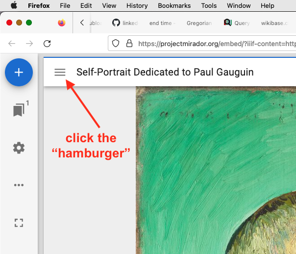
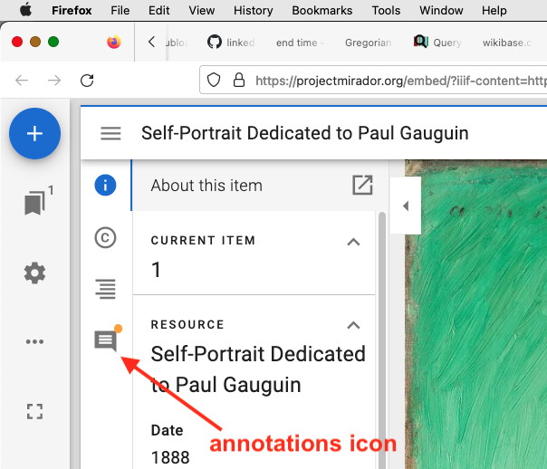
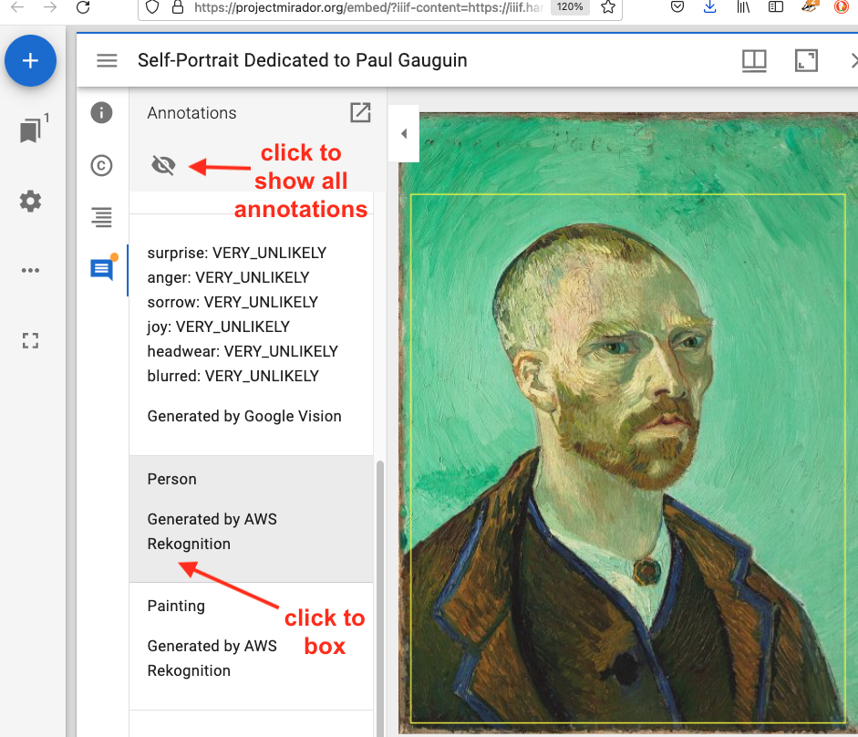

# Utility website for serving IIIF manifests

The base URL for this website is <https://baskaufs.github.io/iiif/>.

## Serving a manifest

To serve a manifest from a subdirectory, append the subdirectory name, followed by the manifest file name. For example:

<https://baskaufs.github.io/iiif/baskauf/getty.json>

## Editing a manifest

An online manifest editor is available at <https://digital.bodleian.ox.ac.uk/manifest-editor/>. To load the manifest, use the manifest URL (as above). Save the manifest in your GitHub directory with a distinctive name and push it to GitHub using GitHub Desktop.

## Displaying a manifest

Many collections have custom viewers, where the viewer is styled to be consistent with the theme of the institution's website. Here is an example from the Getty Museum collection:

<https://www.getty.edu/art/collection/object/103RAG>

Viewing the [full artwork details](https://www.getty.edu/art/collection/object/103RAG#full-artwork-details) at the bottom of the page gives you access to the IIIF manifest link. You can display that manifest in one of several generic viewers, either directly or by downloading the manifest, hacking it if desired, and serving it from your own website (as I've done below).

### Mirador

Append the manifest URL to the end of 

```
https://projectmirador.org/embed/?iiif-content=
```

For example:

<https://projectmirador.org/embed/?iiif-content=https://baskaufs.github.io/iiif/baskauf/getty.json>

### Universal Viewer

Append the manifest URL to the end of 

```
https://universalviewer.io/uv.html?manifest=
```

For example:

<https://universalviewer.io/uv.html?manifest=https://baskaufs.github.io/iiif/baskauf/getty.json>

### Open Seadragon viewer at Cogapp

Append the manifest URL to the end of

```
https://storiiies.cogapp.com/viewer?manifest=
```

For example:

<https://storiiies.cogapp.com/viewer?manifest=https://storiiies.cogapp.com/holbein/manifest.json>

Manifest served from our website:

<https://storiiies.cogapp.com/viewer?manifest=https://baskaufs.github.io/iiif/baskauf/ambassadors_manifest.json>

NOTE: In this example, the annotations are in a separate file referenced from the manifest:

<https://baskaufs.github.io/iiif/baskauf/ambassador_annotations.json>

Unfortunately, it appears that this viewer will only work with images served from the storiiies.cogapp.com server. So although we can hack this manifest, we can't use it with manifests from our own image server.

## Displaying annotations

Here's an example of a manifest with multiple images and separate annotations for each one:

<https://iiif.harvardartmuseums.org/manifests/object/299843>

If I append this manifest URL to the generic Mirador viewer, I can view the annotations

<https://projectmirador.org/embed/?iiif-content=https://iiif.harvardartmuseums.org/manifests/object/299843>

Click on the hamburger in the upper left.



Then click on the Annotations icon.



Clicking on a particular annotation will display its box. Clicking on the eye icon will display boxes for all annotations.



### Creating your own annotations

Here is an annotated image from the Gallery Collection (The Painter and His Pug, print by William Hogarth, 1795, Vanderbilt Fine Arts Gallery 1974.027). The bounding boxes and object recognition were determined by the Google Cloud Vision AI.

<https://projectmirador.org/embed/?iiif-content=https://baskaufs.github.io/iiif/baskauf/painter_dog.json>

Manifest URL:

<https://baskaufs.github.io/iiif/baskauf/painter_dog.json>

Notice that the last section of the manifest has an `otherContent` section with a link to the annotations document (below).

Annotations URL:

<https://baskaufs.github.io/iiif/baskauf/harvard_annotations.json>

Notice that the `selector` values specify the x, y, width, and height of the bounding box. Modifying these values would fix the issues with the bounding box for the person.

# Additional examples

## Yale Center for British Art

Custom viewer

<https://collections.britishart.yale.edu/catalog/tms:390>

Manifest URL

<https://manifests.collections.yale.edu/ycba/obj/390>

## Portain Biblissima

Custom viewer

<https://portail.biblissima.fr/en/ark:/43093/mdata3dcb4570ef3c67e9cf38f6384bf89faf001d54bf>

Manifest URL

<https://digi.ub.uni-heidelberg.de/diglit/iiif/cpgraec222/manifest.json>

## Additional storiiies annotation examples

### Medieval Arab Horsemanship

<https://storiiies.cogapp.com/viewer?manifest=https://storiiies.cogapp.com/qdl/manifest.json>

### Dore's "Dante meets the giants"

<https://storiiies.cogapp.com/viewer?manifest=https://storiiies.cogapp.com/dante/manifest.json>

### Drummand Family

This example uses annotations on multiple canvases.

<https://storiiies.cogapp.com/viewer?manifest=https://storiiies.cogapp.com/ycba/manifest.json>

View manifest in Mirador

<https://projectmirador.org/embed/?iiif-content=https://storiiies.cogapp.com/ycba/manifest.json>
